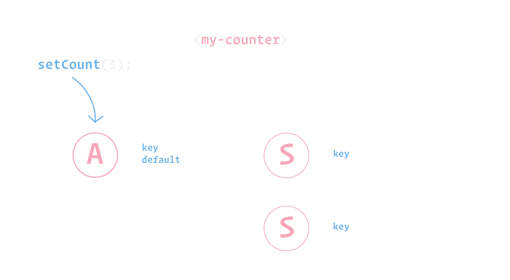

# Selectors || 2

## Introduction

Selectors depend on Atoms, and can be thought of as pieces of _derived_, or _computed_ state. Whenever an Atom has updated, it will notify any Selectors that depend on it, and cause the Selectors `get` function to execute.

The `selector` function takes an object with 2 properties:
- `key`: a unique key to identify the Selector, this key will also be made available as a property on your custom element to read the Selector value from
- `get`: a function that executes any time a Selectors dependencies change to return the new value. This function can also be async.

```js
import { atom, selector } from '@klaxon/atom';

const [count, setCount] = atom({
  key: 'count',
  default: 1
});

const doubleCount = selector({
  key: 'doubleCount', // assign a *unique key*
  get: ({getAtom}) => {
    const originalCount = getAtom(count);
    return originalCount * 2;
  }
});

setCount(3);
```


## Subscribing to Selectors

You can subscribe your component to a Selector by adding it to the static `selectors` getter, and using the `LitAtom` Mixin:

```js
class MyElement extends LitAtom(LitElement) {
  static selectors = [doubleCount];

  render() {
    return html`<p>doublecount: ${this.doubleCount}</p>`;
  }
}
```

> Note that it's not required to add `doubleCount` to LitElements static `properties` getter. It's still fine to do however if, for example, you want to access the value during LitElements lifecycle callbacks, like `updated`.

The `LitAtom` mixin will subscribe to any changes for the `doubleCount` Selector, and rerender your component. You can access the value of the `doubleCount` Selector in your component like so: `this.doubleCount` (👈 the `key` value of the Selector).

## Nested Selectors

Selectors can also depend on other Selectors:

```js
import { LitElement, html } from 'lit-element';
import { LitAtom, atom, selector } from '@klaxon/atom';

const [count, setCount] = atom({
  key: 'count',
  default: 1
});

const doubleCount = selector({
  key: 'doubleCount',
  get: ({getAtom}) => {
    const originalCount = getAtom(count);
    return originalCount * 2;
  }
});

const doubleCountPlusTen = selector({
  key: 'doubleCountPlusTen',
  get: async ({getSelector}) => {
    const double = await getSelector(doubleCount);
    return double + 10;
  }
});

setCount(3);

class MyElement extends LitAtom(LitElement) {
  static selectors = [doubleCountPlusTen];

  render() {
    return html`<p>doublecountPlusTen: ${this.doubleCountPlusTen}</p>`;
  }
}
```

> Note that `getSelector` is async.

The order of execution here is:
- The Atoms store is updated to `3`
- `doubleCount` executes its `get` function and returns `6`
- `doubleCountPlusTen` executes its `get` function and returns `16`



You can read more about Atom's update scheduling [here](../faq/#update-timing).

## Inactive Selectors

It could be the case that you have dynamic components in your app, or maybe you have a Single Page Application (SPA) where different views are loaded dynamically. It would be wasteful if Selectors would still execute while no component currently makes use of a Selector, because you may be in a completely different part of the application.

If no components are currently registered to a Selector, the Selector will become _inactive_, and will avoid updating. Consider the following example:

```js
const userProfile = selector({
  key: 'userProfile',
  get: async ({getAtom}) => {
    const id = getatom(userId);
    const res = await fetch(`/api/${id}`);
    const body = await res.json();
    return body.profile;
  }
});
```

If no component makes use of the `userProfile` Selector, we may still want to update the `userId` Atom. But in this case, it would be wasteful to still run the `userProfile` Selectors `get` function, if no component is making use of it. If this is the case, no component makes use of the `userProfile` Selector, the Selector will avoid updating.

Whenever a component is rendered that makes use of the `userProfile` Selector again, it'll execute the Selectors `get` function and update according to the latest state of the `userId` Atom.

### Selectors depending on inactive Selectors

If you have Selectors depending on a Selector that may have become inactive, the inactive's Selector _will_ still run. Consider the following example:

```js
// No component is currently subscribed to this Selector
const userProfile = selector({
  key: 'userProfile',
  get: async ({getAtom}) => {
    const id = getatom(userId);
    const res = await fetch(`/api/${id}`);
    const body = await res.json();
    return body.profile;
  }
});

// A component *is* currently subscribe to this Selector
const userFullName = selector({
  key: 'userFullName',
  get: async ({getSelector}) => {
    const { firstName, lastName } = await getSelector(userProfile);
    return `${firstName} ${lastName}`;
  }
});
```

In this case, the inactive `userProfile` Selector will still execute; because it has another Selector that depends on it.