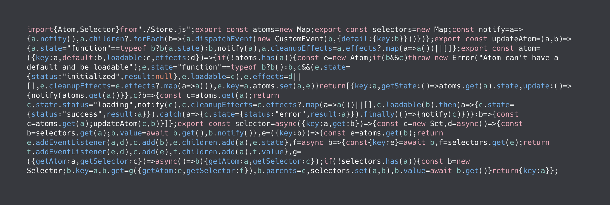
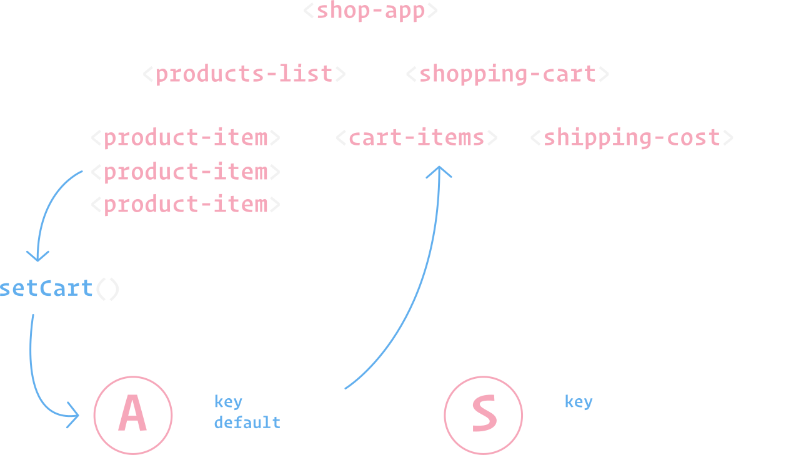

<script type="module" src="./components/wcd-snippet.js"></script>

## Quickstart 👇



`@klaxon/atom` is a flexible state manager that makes use of modern web platform features like ES Modules, and EventTarget. The [core](https://github.com/thepassle/atom/blob/master/src/core.js) of `@klaxon/atom` is very small and checks in at about `1.6kb` (compressed). There is currently an integration for `LitElement`, `Haunted`, and `Preact`, but the core concepts are not restricted to or depending to these libraries, feel free to implement your own integration using the core.

You can start using `@klaxon/atom` incrementally in your apps as you require shared state, or even combine it with other state managers.

This project is heavily inspired by [Recoil](https://recoiljs.org/), but not a 1-1 port.

<div id="graph">



</div>

### Install

Install with npm:

```bash
npm i -S @klaxon/atom
```

### Atoms

Atoms represent small pieces of reusable state, and maintain their own internal store. Whenever an update is triggered (by calling the setter function of that Atom), the Atom store dispatches an event. All components that are subscribed to that Atom will get the event, trigger an update, and cause only the relevant components to update and rerender.

```js
import { atom } from '@klaxon/atom';

const [count, setCount] = atom({
  key: 'count',
  default: 1
});

console.log(count.getState()); // 1

setCount(2);

setCount(old => old + 1);

console.log(count.getState()); // 3
```

### Selectors

Selectors _don't_ maintain their own internal store, instead they are dependent on Atoms. Whenever an Atom changes, any Selector that depends on that Atom will be notified, and execute the Selectors `get` function to return a new value. Selectors can be thought of as pieces of _derived_ state, or _computed_ state.

```js
import { atom, selector } from '@klaxon/atom';

const [count, setCount] = atom({
  key: 'count',
  default: 1
});

const doubleCount = selector({
  key: 'doubleCount',
  get: ({getAtom}) => {
    const originalCount = getAtom(count);
    return originalCount * 2;
  }
});
```

### Basic usage with LitElement

You can use Atoms by registering them to a component in the static `atoms` getter, this will subscribe the component to updates for that Atom. Whenever an update for the Atom has occured, your component will set the new value of the Atom on the component, and cause the element to update.

<wcd-snippet class="landing-page" data-id="4jOEMPDsdljAVmAmoQSJ">

  ```js
  import { LitElement, html } from "lit-element";
  import { LitAtom, atom } from "@klaxon/atom";

  const [count, setCount] = atom({
    key: 'count',
    default: 0
  });

  export class MyCounter extends LitAtom(LitElement) {
    static atoms = [count];

    render() {
      return html`
        <button @click="${() => setCount(old => old - 1)}">-</button>
        <span>${this.count}</span>
        <button @click="${() => setCount(old => old + 1)}">+</button>
      `;
    }
  }

  customElements.define("my-counter", MyCounter);
  ```

</wcd-snippet>

### Todo app demo

<wcd-snippet class="landing-page" data-id="e530K7dhKDxqpoocCOu5">

  ```js
  import { LitElement, html } from 'lit-element';
  import { LitAtom, atom, selector } from '@klaxon/atom';

  export const [todoListFilter, setTodoListFilter] = atom({
    key: 'todoListFilter',
    default: 'Show All',
  });

  export const [todoList, setTodoList] = atom({
    key: 'todoList',
    default: [
      {text: 'not done', isComplete: false, id: 0},
      {text: 'done', isComplete: true, id: 1},
    ]
  });

  const filteredTodoList = selector({
    key: 'filteredTodoList',
    get: ({getAtom}) => {
      const filter = getAtom(todoListFilter);
      const list = getAtom(todoList);

      switch (filter) {
        case 'Show Completed':
          return list.filter((item) => item.isComplete);
        case 'Show Uncompleted':
          return list.filter((item) => !item.isComplete);
        default:
          return list;
      }
    },
  });

  class TodoList extends LitAtom(LitElement) {
    static atoms = [todoListFilter];
    static selectors = [filteredTodoList];

    render() {
      return html`
        <div>
          <h1>${this.todoListFilter}</h1>
          <button @click=${() => setTodoListFilter("Show All")}>show all</button>
          <button @click=${() => setTodoListFilter("Show Completed")}>show completed</button>
          <button @click=${() => setTodoListFilter("Show Uncompleted")}>show uncompleted</button>
        </div>
        <br/>
        <div>
          <button @click=${() => setTodoList((oldTodoList) => [...oldTodoList, {text: 'New todo', isComplete: false, id: 1}])}>add</button>
        </div>
        <div>
          <ul>
            ${this.filteredTodoList?.map(todo => html`<li>${todo.text}</li>`)}
          </ul>
        </div>
      `;
    }
  }

  customElements.define('todo-app', TodoList);
  ```

</wcd-snippet>